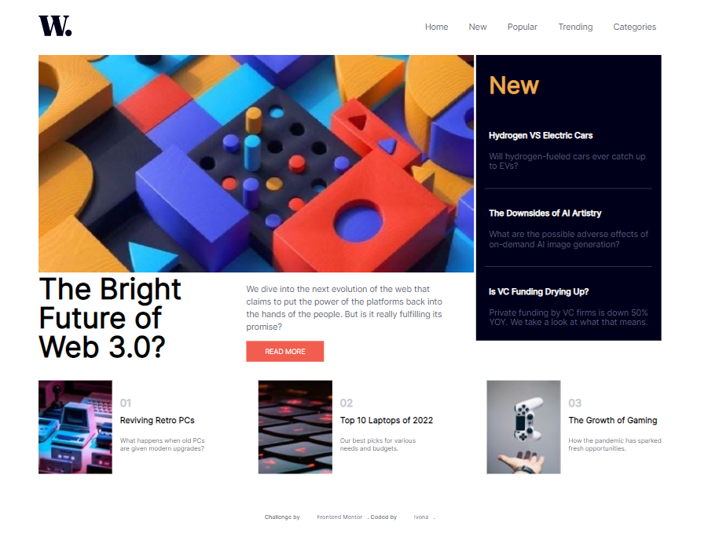
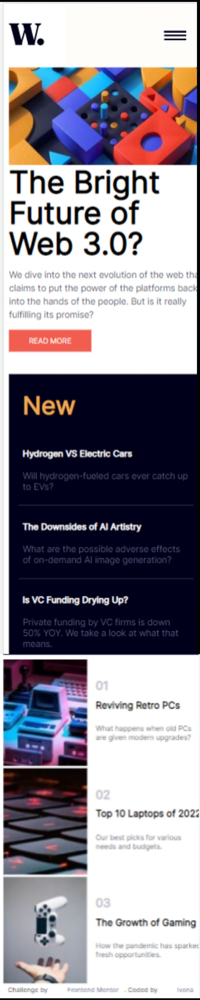
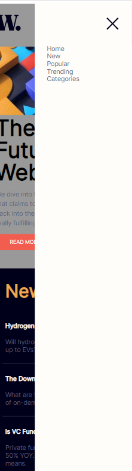
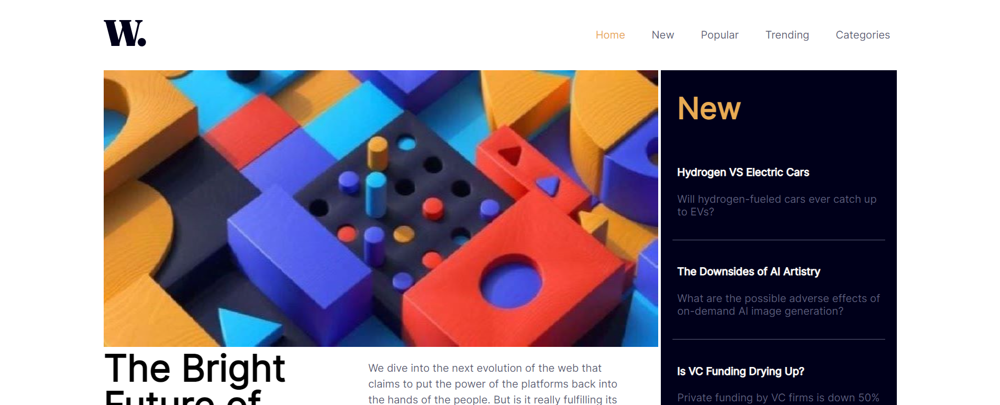

# Frontend Mentor - News homepage solution

This is a solution to the [News homepage challenge on Frontend Mentor](https://www.frontendmentor.io/challenges/news-homepage-H6SWTa1MFl). Frontend Mentor challenges help you improve your coding skills by building realistic projects. 

## Table of contents

- [Overview](#overview)
  - [The challenge](#the-challenge)
  - [Screenshot](#screenshot)
  - [Links](#links)
- [My process](#my-process)
  - [Built with](#built-with)
  - [What I learned](#what-i-learned)
  - [Continued development](#continued-development)
  - [Useful resources](#useful-resources)
- [Author](#author)


**Note: Delete this note and update the table of contents based on what sections you keep.**

## Overview

### The challenge

Users should be able to:

- View the optimal layout for the interface depending on their device's screen size
- See hover and focus states for all interactive elements on the page
- **Bonus**: Toggle the mobile menu (requires some JavaScript)

### Screenshot

1. 
2. 
3. 
4. 

Above are screenshots of my solution for this callenge: 

1."screenshot_desktop" -> a desktop version of my solution,
2."screenshot_mobile" -> mobile version of solution,
3."screenshot_menu" -> mobile menu done with plain JavaScript,
4."screenshot_active" -> active states on navbar


<!-- ### Links

- Solution URL: [Add solution URL here](https://your-solution-url.com)
- Live Site URL: [Add live site URL here](https://your-live-site-url.com) -->

## My process

### Built with

- Semantic HTML5 markup
- CSS custom properties
- Flexbox
- CSS Grid
- JavaScript, DOM manipulation


<!-- ### What I learned


Use this section to recap over some of your major learnings while working through this project. Writing these out and providing code samples of areas you want to highlight is a great way to reinforce your own knowledge.

To see how you can add code snippets, see below:

```html
<h1>Some HTML code I'm proud of</h1>
```
```css
.proud-of-this-css {
  color: papayawhip;
}
```
```js
const proudOfThisFunc = () => {
  console.log('🎉')
}
``` -->


### Continued development

This is my first challange on Frontendmentor, so I think I have more space for improvement, but I also know I have a lot things to learn and practice more. 

I want to practice more how to make page responsive, and compliting tasks using only JavaScript. Learning and understanding logic beyond it, because I think it would help me to solve more advantage tasks by myself. I also want to learn how to write 
less but more or at least same efficient code. And at the end use some framework to complete same tasks or some other maby more complicated tasks and challenges.


### Useful resources


- [Grid layout](https://scrimba.com/learn/cssgrid) - I took online course for understanding grid layout
- [Grid layout](https://css-tricks.com/snippets/css/complete-guide-grid/) - this also helped me for making grid. I recommend it for beginners in this part of css.
- [Grid responsive](https://www.w3schools.com/howto/tryit.asp?filename=tryhow_css_image_grid_responsive) - with this i figured out what is missing in my code to make my grid layout resposnive. 


## Author

- GitHub - [ivona99](https://github.com/ivona99)
- Frontend Mentor - [@Ivona99](https://www.frontendmentor.io/profile/ivona99)


